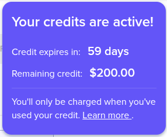
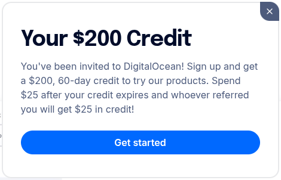
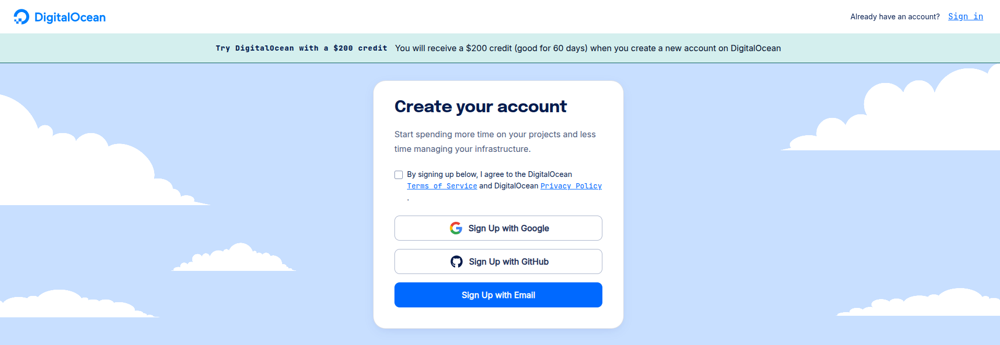

# 🚀 Cupom DigitalOcean 2026: Ganhe $200 de Crédito Grátis Agora

### **[👉 CLIQUE AQUI PARA ATIVAR $200 DE CRÉDITO 👈](https://www.digitalocean.com/?refcode=1cc5d342b842&utm_campaign=Referral_Invite&utm_medium=Referral_Program&utm_source=badge)**

*Válido para Novos Usuários • Verificado Janeiro 2026 • Ativação Imediata*

---
[🔙 Back to English](../README.md)

## 🔥 Por que usar este código promocional da DigitalOcean?

Você está procurando o melhor **cupom da DigitalOcean em 2026**? Você encontrou. Este link exclusivo oferece **$200 dólares em crédito gratuito** para usar na plataforma de nuvem premium da DigitalOcean por 60 dias.

Seja você um desenvolvedor, startup ou estudante, este crédito permite:
- **Criar Droplets**: Lance máquinas virtuais (VPS) em segundos.
- **Hospedar Apps Web**: Escale suas aplicações React, NodeJS, Python ou Go globalmente.
- **Banco de Dados Gerenciado**: Execute PostgreSQL, MySQL e Redis sem dor de cabeça.
- **Kubernetes**: Experimente K8s sem pagar nada.

## 📋 Como Resgatar Seu Crédito de $200

1.  **Clique no Link**: [**ATIVAR CUPOM**](https://www.digitalocean.com/?refcode=1cc5d342b842&utm_campaign=Referral_Invite&utm_medium=Referral_Program&utm_source=badge)
    > [!TIP]
    > **Dica**: Use o **Google Pay** para verificação instantânea! É mais fácil e não faz cobrança imediata.

2.  **Cadastre-se**: Crie uma nova conta usando seu e-mail, Google ou GitHub.

    

3.  **Verifique o Pagamento**: Escolha **Google Pay** (Melhor Opção) ou cartão.
    *   *Você NÃO será cobrado se permanecer dentro do limite do crédito.*

    

4.  **Comece a Construir**: O crédito de $200 é aplicado imediatamente ao seu saldo.

    

> [!IMPORTANT]
> **Nenhum código necessário!** O cupom já está embutido automaticamente no link. Basta clicar e se cadastrar.

## 💡 Principais Recursos da DigitalOcean
*   **Interface Simples**: O painel de controle mais amigável do mercado.
*   **Preços Previsíveis**: Sem surpresas na fatura. Você sabe exatamente o que paga.
*   **Alta Performance**: Armazenamento SSD e rede ultra-rápida.
*   **Data Centers Globais**: Hospede seus dados em NY, São Francisco, Londres, Amsterdã, Singapura, etc.

---

## 🤖 OpenClaw: Assistente de IA no DigitalOcean

- 📖 [Instalar OpenClaw no DigitalOcean](https://gist.github.com/ashio-git/7572a5fe57fd722d2180db96cad8db35)
- 📱 [Configuração Telegram & WhatsApp](https://gist.github.com/ashio-git/b8236b92bdc9591ad29bb7dfdf20c025)
- 🛡️ [Segurança do OpenClaw](https://gist.github.com/ashio-git/3cd50f7de18b77ea506d5e6eb9e97c33)

---

## 💻 ModelArk: IA Barata para Programação

### 💰 [10% OFF — Primeiro Mês $4.50 USD](https://www.byteplus.com/activity/codingplan?ac=MMAUCIS9NT1S&rc=BLS887N6)

- 📖 [IA Barata com OpenClaw + ModelArk](https://gist.github.com/ashio-git/5337c03dfa2e6bc0b48c9941576a8b7b)
- 🔧 [Configurar Aider com ModelArk](https://gist.github.com/ashio-git/fec6b87b5cad387eed4ca66f0d7f1d6c)
- 📊 [Comparação de Modelos](https://gist.github.com/ashio-git/c98262ca67a507db201be9420b4814b2)

---

## ❓ Perguntas Frequentes (FAQ)

**P: Este cupom da DigitalOcean é legítimo?**
R: Sim! Este é um link de referência oficial que fornece o bônus padrão para novos usuários.

**P: Eu preciso de um cartão de crédito?**
R: Sim, a DigitalOcean exige um método de pagamento para verificação de identidade e evitar spam.

**P: Posso usar isso em contas existentes?**
R: Não, esta oferta é estritamente para **novas contas apenas**.

---

<small>2026 Códigos Promocionais DigitalOcean | Melhor VPS Grátis | Hospedagem Cloud</small>

